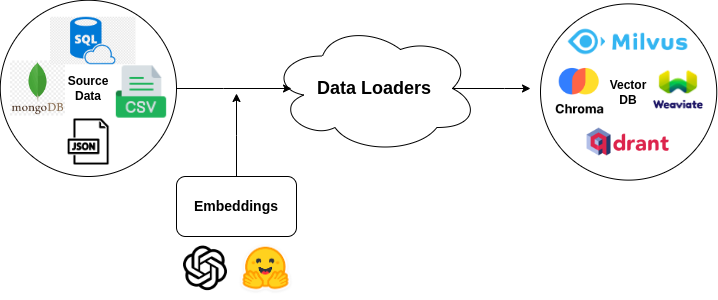

# ✨ Introduction

LLM Stack has two main components level abstraction:

### ETL

<figure><figcaption></figcaption></figure>

### Retrival/Model

<figure><figcaption></figcaption></figure>

Check the components for detailed explaination on the components:

* [ETL](../../docs/components/ETL.md)
* [VectorDB](../../docs/components/VectorDB.md)
* [Retrieval](../../docs/components/Retreiver.md)
* [Model](../../docs/components/Model.md)
