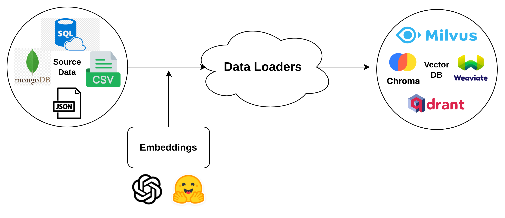

# 📄 Data Extraction and Loading

## Explanation

Data extraction and loading (ETL) is the process of sourcing data from diverse origins, transforming it for usability, and loading it into a target system.&#x20;

ETL stands for Extract, Transform and Load. These are the three main steps to convert/move from a data source to a target destination.

Here we are getting  the documents from various different sources (Extract) and converting it into embeddings (transform) and finally loading it to a vector database (Load) . Hence this ETL process achieves the data loading part from a source to a vectordb destination.

**Our workflow diagram:**&#x20;

<figure><figcaption><p>Data Loaders Architecture Diagram</p></figcaption></figure>

### Supported Data Loaders:

Currently we support three ETL platforms , they are:

* Airbyte&#x20;
* Llama Hub&#x20;
* Langchain&#x20;

You can use any one of these loaders to carry out the ETL process.&#x20;

## How to Use:&#x20;

### Quickstart Loaders&#x20;

We support some 5 loaders out of the box from langchain they are&#x20;

LangChain provides a set of default document loaders for extracting data from various sources. This document outlines the available default data source types, how to configure them using the provided code, and example usage for each type.

### Default Data Source Types

LangChain supports the following default data source types:

* **CSV**: Comma-separated values file.
* **PDF**: Portable Document Format file.
* **WEB**: Web-based content.
* **JSON**: JSON-formatted file.
* **MARKDOWN**: Markdown-formatted file.

### Configuration and Usage

The provided code includes a class named `FileDataSources`, which defines constants for each default data source type. It also includes a dictionary named `FILE_DATA_SOURCES_MAP`, which maps each data source type to its corresponding loader and default parameter name.

The function `get_config_from_source_kwargs` is provided to generate a configuration based on the data source type and provided source information.

#### Example Usage

Here's how you can use the provided code to configure and use each default data source type:

```
from llm_stack.etl.lang_loader import LangLoaderEtl
from llm_stack.etl.utils import get_config_from_source_kwargs
```

1. **CSV Source Example**:

```python
etl = LangLoaderEtl.from_kwargs(get_config_from_source_kwargs(FileDataSources.CSV, "/path/to/data.csv"))
etl.run()
```

2. **PDF Source Example**:

```python
etl = LangLoaderEtl.from_kwargs(get_config_from_source_kwargs(FileDataSources.PDF, "/path/to/document.pdf"))
etl.run()
```

3. **Web Source Example**:

```python
etl = LangLoaderEtl.from_kwargs(get_config_from_source_kwargs(FileDataSources.WEB, {"web_path": "https://example.com"}))
etl.run()
```

4. **JSON Source Example**:

```python
etl = LangLoaderEtl.from_kwargs(get_config_from_source_kwargs(FileDataSources.JSON, "/path/to/data.json"))
etl.run()
```

5. **Markdown Source Example**:

```python
etl = LangLoaderEtl.from_kwargs(get_config_from_source_kwargs(FileDataSources.MARKDOWN, "/path/to/content.md"))
etl.run()
```

Please note that the examples assume the existence of the `LangLoaderEtl` class and its associated methods, as well as the specific loaders mentioned in the provided code. You may need to adjust the code examples according to your implementation details and the specific functionalities of the loaders.

## General Configuration Structure

The ETL configuration is organized into two primary sections: `source` and `vectordb`.

#### Source Configuration

```json
"source": {
    "name": "source_component_name",
    "fields": {
        "parameter_name": "parameter_value",
        ...
    }
}
```

In this section:

* `"name"`: Specifies the name of the data extraction component to be used.
* `"fields"`: Contains key-value pairs representing the specific parameters required by the data extraction component.

#### Vectordb Configuration

The `vectordb` section defines the vector database where the processed data will be loaded.

```json
"vectordb": {
    "name": "vectordb_name",
    "class_name": "entity_class",
    "fields": {
        "parameter_name": "parameter_value",
        ...
    }
}
```

In this section:

* `"name"`: Specifies the name of the vector database.
* `"class_name"`: Specifies the entity class or type associated with the loaded data.
* `"fields"`: Contains key-value pairs representing the specific parameters needed to connect to the vector database.

### Usage

### Using Python Dictionary Configuration

You can represent your configuration as a Python dictionary and pass it directly to the `LangLoaderEtl.from_kwargs()` method. This provides a more programmatic and dynamic way of configuring your ETL process.

#### Example Python Dictionary Configuration

Below is an example of how you can define your ETL configuration as a Python dictionary:

```
python
```

```python
config = {
    "source": {
        "name": "CSVLoader",
        "fields": {
            "file_path": "/path/to/data.csv"
        }
    },
    "vectordb": {
        "name": "weaviate",
        "class_name": None,
        "fields": {
            "url": "http://localhost:8002/"
        }
    }
}
```

#### Using Python Dictionary Configuration

Once you have defined your configuration as a Python dictionary, you can use it with the `LangLoaderEtl.from_kwargs()` method:

```
python
```

```python
etl = LangLoaderEtl.from_kwargs(config)
etl.run()
```

### Loading Configuration from JSON File

If you have your configuration defined in a JSON file, you can use the `LangLoaderEtl.from_config()` method to load it. Here's how:

```
python
```

```python
json_file_path = "path/to/your/config.json"
etl = LangLoaderEtl.from_config(json_file_path)
etl.run()
```

### Benefits of Using Python Dictionary Configuration

* **Dynamic Configuration**: Python dictionaries allow you to dynamically generate configurations based on variables and logic.
* **Integration with Code**: You can easily integrate the configuration within your code, making it easier to manage and maintain.

The ETL process begins with data extraction from the specified source using the defined data extraction component. The extracted data may undergo transformation as required. The transformed data is then loaded into the vector database for efficient storage and retrieval using the parameters specified in the `vectordb` section.

For specific details on available data extraction components, their parameters, and the vector database configuration, refer to the respective documentation provided for each component.

***

And now, here's the example JSON configuration you provided integrated into the documentation:

<pre class="language-json"><code class="lang-json"><strong>{
</strong>    "source": {
        "name": "CSVLoader",
        "fields": {
            "file_path": "users.csv"
        }
    },
    "vectordb": {
        "name": "weaviate",
        "class_name": null,
        "fields": {
            "url": "http://localhost:8002/"
        }
    }
}
</code></pre>

Please note that the actual details and parameters within the JSON configuration might vary based on the specific components and vector database being used. Adjust the documentation accordingly to match the functionalities and attributes of those components.

