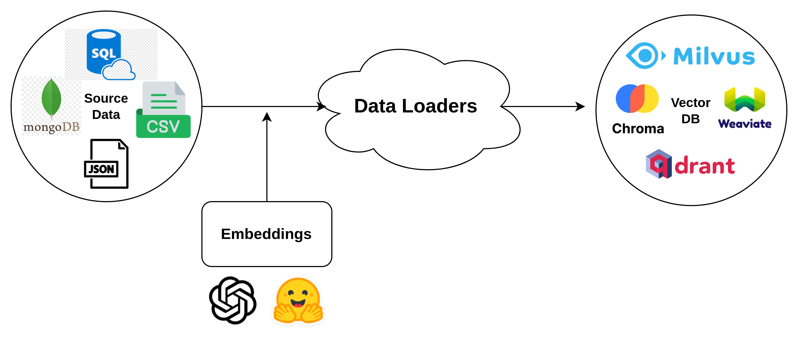

# 🚜 ETL

## Explanation

ETL is the process of sourcing data from diverse origins, transforming it for usability, and loading it into a target system.

ETL stands for Extract, Transform and Load. These are the three main steps to convert/move from a data source to a target destination.

Here we are getting the documents from various different sources (Extract) and converting it into embeddings (transform) and finally loading it to a vector database (Load) . Hence this ETL process achieves the data loading part from a source to a vectordb destination.

**Our workflow diagram:**

<figure><figcaption>
Data Loaders Architecture Diagram
</figcaption></figure>

### Supported Data Loaders:

Currently we support three ETL platforms , they are:

* Airbyte
* Llama Hub
* Langchain

You can use any one of these loaders to carry out the ETL process.
