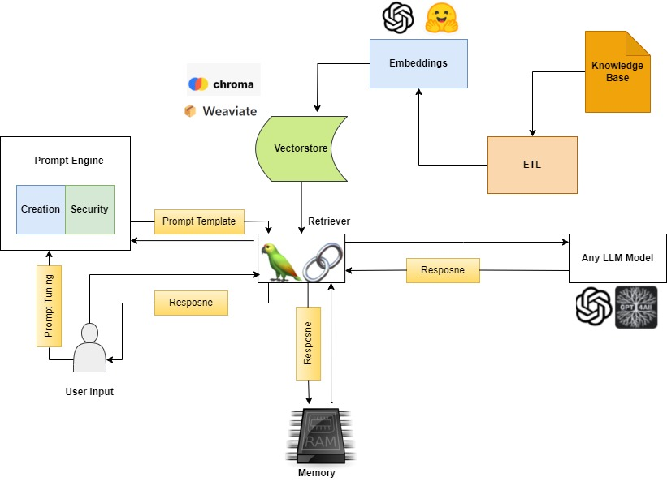

# Knowledge Base Q&A:

Provide direct, dynamic answers from databases, making data access swift and user-friendly.

## GenAI Stack Workflow for Knowledge Base Question & Answer



## Installing GenAI Stack

```
!pip install genai_stack
```

Componets used for implementation
- gpt-3.5-turbo as LLM
- Chromadb as Vectorstore
- sentence-transformers/all-mpnet-base-v2 sentence transformer for text embeddings
- Langchain Framework

## Import Required GenAI Stack Components

```py
from genai_stack.stack.stack import Stack
from genai_stack.etl.langchain import LangchainETL
from genai_stack.embedding.langchain import LangchainEmbedding
from genai_stack.vectordb.chromadb import ChromaDB
from genai_stack.prompt_engine.engine import PromptEngine
from genai_stack.model.gpt3_5 import OpenAIGpt35Model
from genai_stack.retriever import LangChainRetriever
from genai_stack.memory.langchain import ConversationBufferMemory
```

## Instantiate ETL component by providing configuration according to source data type.

- Here the input source is .pdf file

```py
etl = LangchainETL.from_kwargs(name="PyPDFLoader", fields={"file_path": "YOUR PDF DOCUMENT PATH"})
```

## Instantiate the LLM

```py
llm = OpenAIGpt35Model.from_kwargs(parameters={"openai_api_key": "YOUR OPENAI API KEY"})

## Instantiate Embedding component using open source Huggingface Model

```py
config = {
    "model_name": "sentence-transformers/all-mpnet-base-v2",
    "model_kwargs": {"device": "cpu"},
    "encode_kwargs": {"normalize_embeddings": False},
}
embedding = LangchainEmbedding.from_kwargs(name="HuggingFaceEmbeddings", fields=config)
```

## Instantiate the Vectorstore

```py
chromadb = ChromaDB.from_kwargs()
chromadb
```

## Instantiate the Retriver

```py
retriever = LangChainRetriever.from_kwargs()
```

## Instantiate the Prompt engine

Prompt engine constructs the prompt template for instructing the LLM

```py
promptengine = PromptEngine.from_kwargs(should_validate=False)
```

## Instantiate Memory

```py
memory = ConversationBufferMemory.from_kwargs()
```

## Setup the GenAI Stack

```py
stack = Stack(
    etl=etl,
    embedding=embedding,
    vectordb=chromadb,
    model=llm,
    prompt_engine=promptengine,
    retriever=retriever,
    memory=memory
)
```

## Performing the ETL operations

1. extracting the content
2. transforrmation(creating embeddings),
3. load(storing the knowledge base in the vectordb)

```py
etl.run()
```

## Ask a question

```py
question = input("Ask a question: ")

response = retriever.retrieve(question)
print(response['output'])
```

## Helper Function to generate response

```py
process = "y"
while process == 'y':
  question = input("Ask a question: ")
  print(f"Question : {question}")
  response = retriever.retrieve(question)
  print(f"Response : {response}")
  print("\n\n")
  process =  input("Do you want to continue : y -to continue, n - to exit :")
  print("\n")
```
